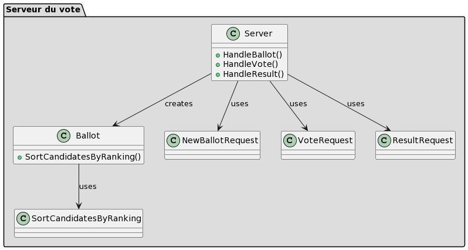

# Serveur de vote
## Participants
- Zikang CHEN [zikang.chen@etu.utc.fr](mailto:zikang.chen@etu.utc.fr)
- Yuan GAO [yuan.gao@etu.utc.fr](mailto:yuan.gao@etu.utc.fr)

## Structure de Projet
- src/
  - cmd/
    - launch.go
  - methods/
    - methods.go
  - server/
    - server.go
  - types/
    - modules.go

服务器端由Server对象实例化，并包含了BallotID对Ballot的映射池，服务器通过launch.go启动，同时调用NewServer方法创建新服务器对象并挂载/new_ballot,/vote,/result命令至相应函数。(默认8080端口)
Majority, Borda等投票方法的实现被定义在methods.go文件中，modules.go文件定义了服务端与客户端通信的JSON格式。

## Comment lancer notre projet
```go
go install github.com/Appointat/Instance-of-Web-Server-API-in-Go/cmd@latest
```
在cmd下执行
```go
go run launch.go
```
此时浏览器已在8080端口上运行(http://localhost:8080)
### Créer un ballot
在 http://localhost:8080/ballot 创建一个投票，执行post命令
```json
{
    "rule": "Majority",
    "deadline": "2023-12-01T00:00:00+01:00",
    "voterIDs": ["Voter1", "Voter2", "Voter3"],
    "Alts": 3,
    "tieBreak": [1, 2, 3]
}
```
此时投票规则设定为Majority并且投票者ID为Voter1....，只有满足以上投票ID的投票者才能投票，非法投票者会返回400bad request错误(this voter ID is not allowed to vote)。
截止日期：2023年12月1日 UTC+0 00:00
候选人：3位
平局截断数组：[1, 2, 3] 出现平局时，最考前的候选人获胜

投票创建成功会返回
```json
{
    "ballot-id": "scrutin0",
}
```
之后创建的投票为scrutin1, scrutin2...
### Comment voter

切换至 http://localhost:8080/vote 

```json
{
    "agent-id": "Voter1",
    "ballot-id": "scrutin0",
    "prefs": [1, 2, 3]
}
```
此时我们成功以Voter1的身份在投票池scrutin0中记录了投票信息[1, 2, 3]。

### Comment obtenir le résultat
切换至 http://localhost:8080/result ,投票池中至少有一位选民投票才能获取结果，否则会返回425错误(result not ready)。

```json
{
    "ballot-id": "scrutin0"
}
```

## Réalisation du projet

这个项目实现了一个简单的网络投票系统，它通过Go语言编写的Web服务器API来管理投票过程。这个系统允许用户创建投票，参与投票，并且在投票结束后获取结果。该项目由四个主要部分组成：

1. `server.go`: 这个文件定义了服务的主要逻辑。它包含了处理投票箱创建、投票行为和结果查询的HTTP处理函数。这个文件还定义了`Server`类型，用于存储投票箱的状态和信息。

2. `modules.go`: 这个文件定义了在客户端与服务器之间通信所需的数据结构，这些结构代表了不同的HTTP请求和响应。

3. `Ballot`结构体: 它定义了一个投票箱的数据结构，包括了规则、截止时间、投票者ID、票数、备选项数、平局决断规则和获胜者。

4. `Server`结构体: 它包含了所有投票箱的映射，当前投票箱的数量和下一个分配的投票箱ID。

以下是这个Web服务的主要流程：

### 创建投票箱 (`HandleBallot`)
1. 解析请求体中的JSON数据到`NewBallotRequest`结构体。
2. 验证规则是否有效（目前仅支持"Majority"、"Borda"、"Condorcet"）。
3. 验证截止时间是否有效。
4. 验证备选项数是否大于2，以及平局决断数组是否有效。
5. 生成投票箱ID，并创建新的`Ballot`实例，存储在服务器状态中。
6. 发送投票箱ID作为响应。

### 投票 (`HandleVote`)
1. 解析请求体中的JSON数据到`VoteRequest`结构体。
2. 验证投票箱ID和投票者ID是否有效。
3. 检查是否在截止时间前。
4. 验证投票者的选票是否合法。
5. 将选票存储在投票箱中，并返回成功的响应。

### 获取结果 (`HandleResult`)
1. 解析请求体中的JSON数据到`ResultRequest`结构体。
2. 验证投票箱ID是否有效。
3. 如果没有投票，则返回错误。
4. 根据投票箱的规则计算结果。
5. 发送包含获胜者和排名的结果作为响应。

`SortCandidatesByRanking`函数负责根据给定的投票方法（多数规则、博达计数、康德赛特法则）计算和排序候选者。

### 技术细节
- **验证**: 所有输入数据都通过严格的验证，确保了系统的健壮性。
- **状态管理**: `Server`结构体作为状态容器，管理所有投票箱的状态。
- **结果计算**: 结果计算依据提供的计票方法。未实现计票方法的具体细节，它们应当作为`methods`包中的函数实现。

整个系统通过HTTP API公开了它的功能，允许客户端通过JSON请求与之交互。服务器端点将解析请求，执行逻辑，并以JSON响应返回结果。项目的结构清晰、模块化，便于维护和扩展。